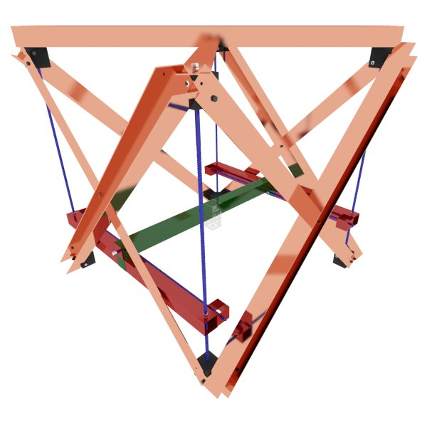

MUS - Multimachine Universally Scalable (massive or light)
===========

4d PlaDruMas - 4 degree of freedom Platinen Druck Maschine
------------

4d CiPriMa - 4 degree of freedom Circuit Print Machine
------------

* A scalable multimachine.
* Minimal material amount.
* Minimal part count.
* Optional 4th DOF (degree of freedom).
* Linux system (not reinventing the wheel when we have a gem like GNU/Linux). If limited RAM or processing power, then RODOS will be chosen for maximum program recycling.

Context
----
###There are two distinct 3D manufacturing machines under development + 1 hybrid:###

* HOG  - HOchGeschwindigkeit (lightweight, medium volume, high velocity)
    * <a href="https://forum.opensourceecology.de/viewtopic.php?f=28&t=619">3D PlaDruMas (PUS - Printer Uniprokit Speedy)</a> [UniProKit Parts + Belts]
* HOF  - HOchFestigkeit (massive, medium to huge, slow)
    * <a href="http://forum.opensourceecology.de/viewtopic.php?f=30&t=617">4D FräDreMas (MUS - Mill Universally Scalable Variant Sheets)</a> [Scrap + precision manufactured massive metal and plexiglas sheets]
* HOFHOG - Best of both worlds (scalable, tiny to giant, probably slow).
    * <a href="http://forum.opensourceecology.de/viewtopic.php?f=30&t=617">4D CiPriMa (MUS - Mill Universally Scalable Variant Crossings)</a> [Easy to source parts (U-profiles, flat/sheet profiles, symmetric parts!, few different parts!)]

###Current development status:###
* Sourcing parts for HOFHOG. Engineering a Linux based solution.

###Current prototype under evaluation:###

All 4 side structures (five with the roof) are completely the same! Simplifies assembly. The cross structure makes it rigid.

The square metal blocks in the corners are the difficult parts.
The rest (leadscrews, U-profiles and flat/sheet-cut profiles) is readily available at local hardware stores.

The steel plates of the previous design were much too heavy to lift. And so expensive!! It's difficult to source them. Thus this easy to source and build multimachine was designed.

###Goals and design considerations:###

* Save structural parts,
* keep the sliding axes open at the bottom side (to allow long parts being stuck through level on the ground for better fixing),
* and still create a rigid frame!
* Protect all axes against twisting around X, Y and Z.
* Use the complete work volume that is available (so no trapezoidal and no sliding sub-table Y-axis, which limits the useful space).
* Employ a Y-axis that is sliding on the X-axis,
* And an X-axis that is sliding on the Z-axis construction,
* so that the Z-axis is very rigid and 
* it's possible to mount all tools as there will not occur twisting due to too long lever (Archimedes) or vibrating.
* The design without the 4 belt disks (with 4 motors instead) allows auto-calibration of the Z axis.
* Support auto-calibration of X and Y axis.

* The way the twist-protection works has benefits but also downsides as more rods and lead screws (ACME or usual rods) are required.
* Allow employing any tools on the base structure.

###This machine can be built/equipped as a: (from cheaper to more expensive, top to bottom)###

* Circuit mill: low weight & small, hence more precise.
* 3D printer common size: build it using very light material.
* 3D printer with large printing volume to finally construct those Statue of Rhodes replica. (in order to get a precise machine to be able to print small parts too and to use this a s circuit mill additionally, this will not get cheap as a high focus has to be on precision manufacturing and that's not a easy DIY thing without the expensive equipment and long-time experience - I lack these also, I'm afraid).
* Heavy duty mill: build it massive (Steel, no hollow rods, ...). For bigger parts. (like Treehouses I planned to construct since long.)
* Heavy duty high precision mill: finally that's very difficult and very expensive, too. You can try, but it's almost impossible as a DIY project, unless you have robots helping out with manufacturing. 3+ phase (stepper) motors might help if smart compensating algorithms and a closed feedback loop control is employed. Sounds expensive in theory, costs even more in practice.

